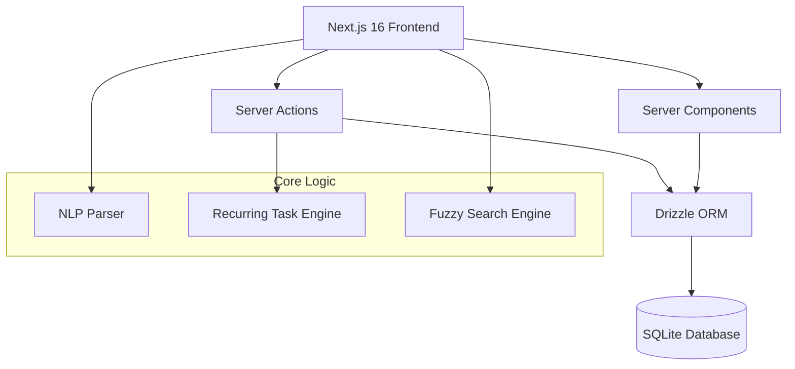

# Modern Daily Task Planner Plan

Building a professional task planner using Next.js 16 (App Router), Drizzle ORM, and SQLite.

## Architecture Overview

## Implementation Phases

### 1. Project Initialization

- Initialize Next.js 16 project with Bun.
- Setup Tailwind CSS, shadcn/ui, and Framer Motion.
- Configure Drizzle ORM with SQLite (`lib/db/schema.ts`).
- Set up local file storage for attachments.

### 2. Database Schema Design

- `lists`: Custom user-defined task categories.
- `tasks`: Core task data (priority, dates, recurring rules, subtasks).
- `labels`: Metadata for tasks with icons.
- `task_logs`: Audit trail for all task changes.
- `attachments`: Links to task-related files.

### 3. Layout and Sidebar

- Create `components/layout/sidebar.tsx` with:
- Magic "Inbox" list.
- User custom lists with color/emoji indicators.
- View navigation (Today, Next 7 Days, Upcoming, All).
- Label filter list.
- Overdue task badge logic.

### 4. Task Management and Views

- Implement `app/(planner)/[view]/page.tsx` to handle dynamic views.
- Create `components/tasks/task-list.tsx` with virtualization for performance.
- Implement toggle logic for completed tasks.
- Build `components/tasks/task-item.tsx` with swipe/click actions and animations.

### 5. Task Detail and Forms

- `components/tasks/task-form.tsx`: Comprehensive task creation/edit form with:
- `zod` validation.
- Date picker and deadline selection.
- Subtask checklist.
- Recurring task configuration (Daily, Weekly, etc.).
- Implement Natural Language Entry ("Lunch with Sarah at 1 PM tomorrow") using basic regex/date-fns parsing.

### 6. Logging and Audit Trail

- Middleware or Server Action wrapper to log changes into `task_logs`.
- Create a view in task details to see the history of changes.

### 7. Search and Performance

- Implement fuzzy search using `fuse.js` or SQLite full-text search.
- Use Next.js 16 View Transitions API for smooth navigation between views.

### 8. Testing and Optimization

- Unit tests for recurring logic and NLP parsing using `bun:test`.